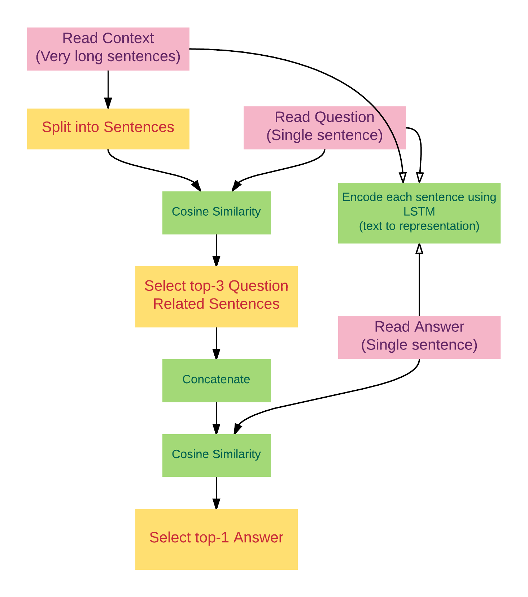
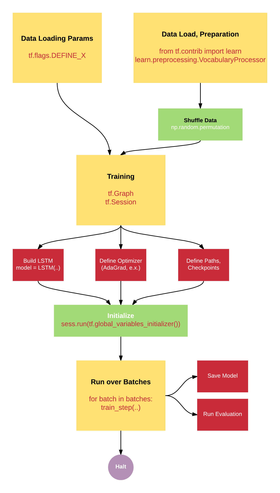

# Requirement

[CSIE 5431 - Applied Deep Learning, Final project - Machine Comprehension](https://www.csie.ntu.edu.tw/~yvchen/f105-adl/P2).

The project is is to implement DeepMind Teaching Machines to Read and Comprehend in [tensorflow](https://github.com/tensorflow/tensorflow).

```
python3 train.py
```

# Mechanism



# Training



# References

- [DeepMind: Teaching Machines to Read and Comprehend](https://github.com/thomasmesnard/DeepMind-Teaching-Machines-to-Read-and-Comprehend)
- [Teaching Machines to Read and Comprehend (blog)](http://rsarxiv.github.io/2016/06/13/Teaching-Machines-to-Read-and-Comprehend-PaperWeekly/)
- [Implementing A Cnn for Text Classfication in Tensorflow](http://www.wildml.com/2015/12/implementing-a-cnn-for-text-classification-in-tensorflow/)
- [Deep Learning for Answer Sentence Selection](http://ttic.uchicago.edu/~haotang/speech/1412.1632v1.pdf) (*)
- [LSTM-Based Deep Learning Models For Nonfactoid Answer Selection](https://arxiv.org/pdf/1511.04108v4.pdf) (*)
- [Official Tensorflow Tutorials](https://www.tensorflow.org/versions/r0.12/tutorials/index.html)
- [Tensorflow Doc(中文)](http://wiki.jikexueyuan.com/project/tensorflow-zh/get_started/basic_usage.html)
